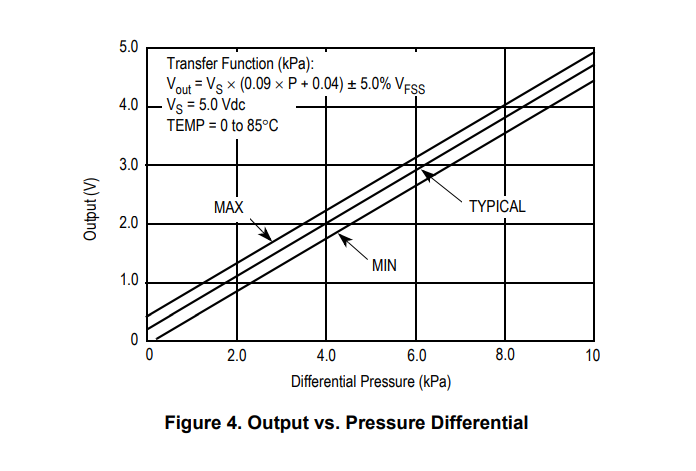

# iAI NeoBreath Open Source Ventilator

## Introduction


## Environment Setup

Python version: 3.5.3

Use the following command to install all the dependencies:

```
pip3 install requirements.txt
```

## Usage

```
python3 main.py
```

## Circuit Wiring


## Sensor and Hardware

### Programming Board

    Raspberry Pi 4 Model B 4GB

### Parts List

| Part Name | Part Model | Pin Address |
| --------- | ---------- | ----------- |
| Pressure sensor A | Adafruit MPRLS | I2C 18 |
| Pressure sensor B | HiLetgo BMP280 | I2C 76 |
| Temperature and humidity sensor | HiLetgo DHT11(Digital) | GPIO 17 |
| Differential pressure sensor| NXP MPX5010DP | NA |
| Analog-to-digital converter (ADC)| ADS1115 | I2C 48|
| Mosfet | IRF520 | GPIO 27 |
| Electronic speed controller (ESC) | Hobbywing Skywalker 50A | GPIO 4 | 
| Electric ducted fan (EDF) | Powerfun EDF 50mm | NA |
| Solenoid valve | DC12V | NA |
| 110V to 12V power supply | NA | NA | 

## Reference

### Raspberry Pi

- [GPIO pins information](https://www.raspberrypi.org/documentation/usage/gpio/README.md)
- [Gpiozero](https://gpiozero.readthedocs.io/en/stable/)
- [RPi.GPIO](https://pypi.org/project/RPi.GPIO/)
- [CircuitPython on Raspberry Pi](https://learn.adafruit.com/circuitpython-on-raspberrypi-linux)

### Parts
- [MPRLS on Raspberry Pi tutorial](https://learn.adafruit.com/adafruit-mprls-ported-pressure-sensor-breakout/overview)
- [DHT11 on Raspberry Pi tutorial](https://www.circuitbasics.com/how-to-set-up-the-dht11-humidity-sensor-on-the-raspberry-pi/)
- [BMP280 on Raspberry Pi tutorial 1](http://www.pibits.net/code/raspberry-pi-and-bmp280-sensor-example.php)
- [BMP280 on Raspberry Pi tutorial 2](https://learn.adafruit.com/adafruit-bmp280-barometric-pressure-plus-temperature-sensor-breakout/overview)
- [MPX5010DP and ADS1115 on Raspberry Pi tutorial](https://github.com/Pi4IoT/Node-RED/tree/master/waterLevel_moisture_Node-RED)
- [IRF520 Mosfet wiring](https://raspberrypi.stackexchange.com/questions/47179/connect-irf520-mosfet-driver-to-a-raspberry-pi-2)
- [ESC on Raspberry Pi tutorial](https://www.instructables.com/id/Driving-an-ESCBrushless-Motor-Using-Raspberry-Pi/)

## Sensor Data Handling

### MPX5010DP - Convert Voltage to Differential Pressure



From the formula given by the part manual, we can calculate the differential pressure according to the voltage:

- Vs = 3.3Vdc
- ignore noise

```
P = (Vout/Vs-0.04)/0.09 = Vout/0.297-0.45
```

### DHT11 - Convert Celsius to Fahrenheit

The temperature digital value returned from the DHT11 sensor is in Celsius. To convert it to Fahrenheit, we use the following formula:

```
F = (C × 9/5) + 32
```

## Respiratory Rate Controlling

The normal respiration rate for an adult at rest is 12 to 20 breaths per minute.

We set the range of the adjustable respiration rate as from 10 to 30 times per minute. It means each respiration takes 2 seconds to 6 seconds. We set the default resp rate as 20.

## I:E Ratio Controlling

I:E ratio refers to the ratio of inspiratory time:expiratory time. In normal spontaneous breathing, the expiratory time is about twice as long as the inspiratory time. This gives an I:E ratio of 1:2. 

The ratio is typically changed in asthmatics due to the prolonged time of expiration. They might have an I:E ratio of 1:3 or 1:4. Even longer expiratory times are required sometimes.

An inverse ratio refers to when the I:E ratio is 2:1 or higher and is typically used to ventilate non-compliant lungs. Pressure control modes of ventilation should be used when employing inverse ratios as the use of volume control modes might lead to breath stacking and an increase in airway pressure.

We set the default I:E ratio as 2:1. The ratio is adjustable within a set of ratios including 2:1, 1:1, 1:2, 1:3, 1:4.